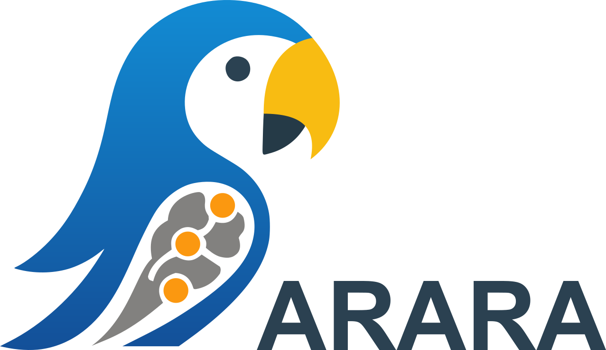
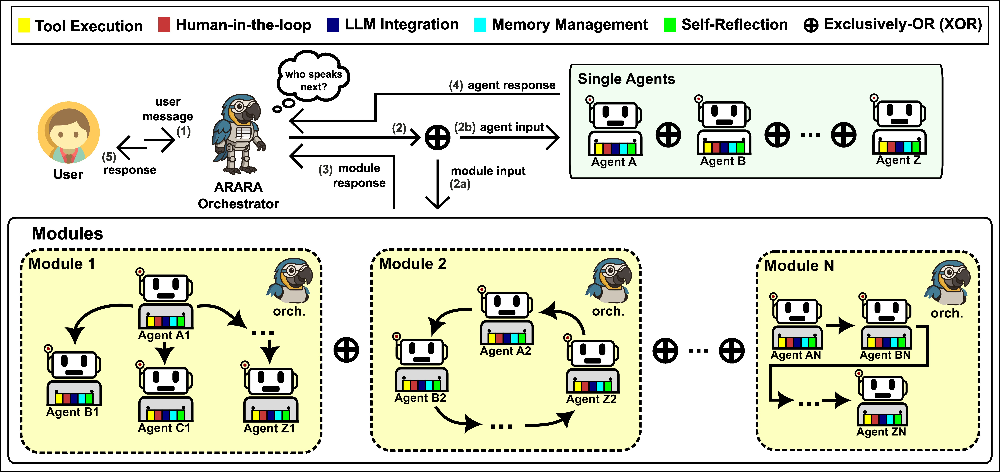

<p align="center">
  <br/>
  <em>A Multi-Agent Framework for Conversational Recommendation Systems with Large Language Models</em>
</p>

ARARA is a modular, extensible framework for orchestrating LLM-based agents in complex recommendation scenarios — particularly those involving dialogue, memory, tools, and reflection.

Unlike existing frameworks such as AutoGen, CrewAI, or LangGraph, ARARA is purpose-built for **conversational recommendation**, with native support for memory, dialogue context awareness, and modular coordination.

### Key Features

- **Agent-based Dialogue Planning**: Dynamically selects the most suitable agent based on dialogue context and user intent
- **Contextual Memory Integration**: Memory is a first-class capability, enabling agents to retain and reason over prior interactions
- **Multi-LLM Support**: Compatible with Groq, OpenAI, and Maritaca.
- **Compositional Modularity**: Agents can operate standalone or within orchestrated modules for scalability and reuse
- **Conversational Recommendation Focus**: Tailored for multi-turn, personalized recommendation scenarios

---

## Architecture

<p align="center">
  

</p>

The architecture includes:

- **Single Agents**: Respond to user prompts
- **Orchestrator Agent**: Coordinates the overall conversation
- **Modules**: Groups of agents governed by internal orchestrators
- **Decision Logic**: Selects the next speaker, invokes tools, leverages memory, and manages outputs

This enables horizontal and vertical scaling of agent-based workflows.

---

## Project Structure

```
src/
├── agents/ # Core agent and orchestrator implementations
├── capabilities/ # Specialized capabilities for agents:
│ # ├── clients/: Wrappers and configs for LLM providers (e.g., OpenAI, Groq, Maritaca)
│ # ├── memory/: Implementations of memory mechanisms (short-term, episodic, etc.)
│ # ├── skills/: Built-in skills such as WebCrawler, WebSearch, Vision, etc.
│ # └── tools/: Tool execution and integration with external functions
├── ioflow/ # Input and output flow management
├── logger/ # Logging utilities for tracking and debugging
├── monitoring/ # Runtime monitoring and diagnostics
├── cache/ # Caching mechanisms and temporary data
```

---

## Use Cases

ARARA was designed as a research-first framework for **conversational recommender systems**, enabling experimentation with:

- Memory strategies in multi-turn recommendation dialogues
- Dialogue planning with agent specialization and turn-taking policies
- Tool-augmented recommendation pipelines for contextual reasoning
- Modular agent orchestration and explainability in multi-agent conversations
- Evaluation protocols for coherence, personalization, and recommendation quality

Ideal for researchers exploring **LLM-powered, dialogue-driven recommendation systems**.

---

## Quick Start Example

From [`notebooks/memory.ipynb`](notebooks/memory.ipynb):

```python
from agents import Agent, User
from capabilities.memory import ListMemory, MemoryContent
import os

llm_config = {
    "config_list": [
        {
            "client": "groq",
            "temperature": 0.0,
            "model": "llama-3.3-70b-versatile",
            "api_key": os.getenv("GROQ_API_KEY")
        }
    ]
}

sequential_memory = ListMemory(name="chat_history")
sequential_memory.add(MemoryContent(content="User likes beef."))

def get_recipe(diet_type: str = "standard") -> str:
    if diet_type == "vegan":
        return "Chickpea pasta with sautéed vegetables"
    elif diet_type == "peanut":
        return "Thai peanut stir-fry"
    else:
        return "Creamy chicken alfredo"

user = User(name="user")
assistant = Agent(
    name="assistant_agent",
    llm_config=llm_config,
    tools=[get_recipe],
    memory=[sequential_memory],
)

chat_result = user.talk_to(
    assistant_agent,
    message="Can you recommend me something for dinner?"
)
```

More examples in the notebooks/ directory.

---

## Run Locally

Clone the repository:

```bash
git clone https://github.com/fsant0s/arara.git
cd arara
```

Install dependencies:

```bash
./scripts/setup_dev_env.sh
```

Or manually:

```bash
uv pip install -e ".[dev]"
```

Set up your environment:

```bash
cp .env.example .env
# Then edit .env with your API keys
```

---

## Dependencies

All production dependencies are version-pinned. Development and testing dependencies are optional and separated.

See [DEPENDENCIES.md](DEPENDENCIES.md) for a full list.

---

## Development

We follow strict code quality practices. Tools used:

- **Black**: Formatting
- **isort**: Import ordering
- **flake8**: Linting
- **mypy**: Static type checking

To apply:

```bash
black . && isort . && flake8 . && mypy .
```

---

## Testing

To run unit and integration tests with coverage:

```bash
./scripts/run_tests.sh
```

Details in [tests/README.md](tests/README.md).

---

## Contributing

We welcome contributions!

Please check:
- [CONTRIBUTING.md](CONTRIBUTING.md)
- [CODE_OF_CONDUCT.md](CODE_OF_CONDUCT.md)

---

## Versioning and Releases

We follow:

- [Conventional Commits](https://www.conventionalcommits.org/)
- [Semantic Versioning](https://semver.org/)

Scripts:

```bash
python scripts/bump_version.py
python scripts/generate_changelog.py
```

---

## Security

Security best practices and contact details are outlined in [SECURITY.md](SECURITY.md).

---

## License

This project is licensed under the [MIT License](https://choosealicense.com/licenses/mit/).

> **Note**: ARARA is based on [AutoGen](https://github.com/microsoft/autogen) and respects its licensing model.
